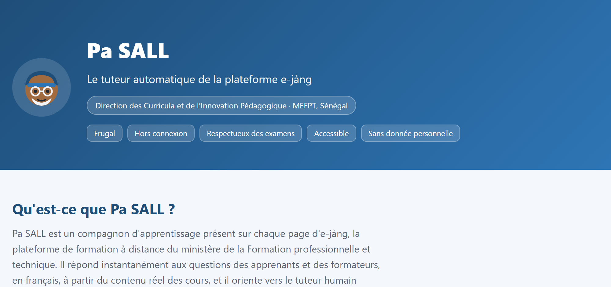
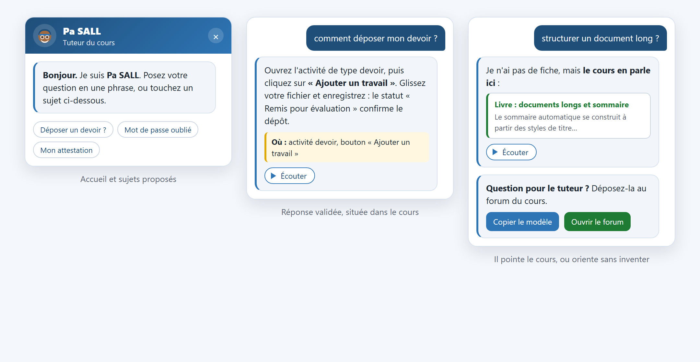

<!-- Bannière -->

# Pa SALL — le tuteur automatique d'e-jàng

**Pa SALL** est un compagnon d'apprentissage présent sur chaque page d'**e-jàng**, la plateforme de formation à distance du ministère de la Formation professionnelle et technique du Sénégal. Il répond instantanément aux questions des apprenants et des formateurs, en français, à partir du contenu réel des cours, et il oriente vers le tuteur humain lorsqu'une réponse validée n'existe pas encore.

Conçu au sein de la **Direction des Curricula et de l'Innovation Pédagogique (DCIP)** pour les réalités du terrain sénégalais : téléphones d'entrée de gamme, connexions modestes, fort besoin d'autonomie.

> 🟢 **En service** sur e-jàng, catégorie Formation Professionnelle.

---

## Pa SALL en images

De gauche à droite : l'accueil et ses sujets proposés, une réponse validée toujours située dans le cours, et le renvoi vers le passage exact du cours ou vers le tuteur humain quand la réponse n'existe pas encore.

*Les visuels sont des reconstitutions de l'interface ; ils ne contiennent aucune donnée réelle d'apprenant.*

---

## Ce qui le distingue

- **📶 Frugal et hors connexion** — pensé pour le téléphone et les réseaux modestes ; il reste utile quand la connexion faiblit.
- **✅ Fidèle, jamais inventif** — il ne répond qu'à partir de contenus validés et du cours réel ; face à l'inconnu, il l'avoue et oriente.
- **📝 Respectueux des examens** — il disparaît pendant les épreuves ; aucun risque qu'il souffle une réponse à un apprenant en test.
- **🔊 Accessible** — lecture à voix haute de chaque réponse, navigation au clavier, respect des réglages de mouvement réduit.
- **🔒 Sans donnée personnelle** — aucune donnée nominative n'est conservée ; la confidentialité est un principe de conception.
- **📈 Un rapport qui fait progresser** — chaque semaine, les questions restées sans réponse deviennent la feuille de route des améliorations.

---

## Comment il aide, concrètement

- **Assistance de la plateforme** : se connecter, retrouver un cours, déposer un devoir, comprendre un badge ou une attestation.
- **Contenu des cours** : il retrouve le passage utile et renvoie directement vers l'activité concernée.
- **Orientation vers l'humain** : lorsqu'une réponse validée manque, il prépare la demande et guide vers le forum du cours.
- **Écoute** : chaque réponse peut être lue à voix haute, pour ceux qui lisent moins facilement.

---

## Genèse

Pa SALL prolonge le dispositif de tutorat humain d'e-jàng et le rend tenable à grande échelle. Il porte le nom d'un de ses artisans, en clin d'œil, et grandit au fil des questions réelles des apprenants.

---

## Voir la présentation

La page de présentation est disponible ici : **https://oumarsall3.github.io/pa-sall/**

---

## À propos de ce dépôt

Ce dépôt **présente** le dispositif. Il ne publie volontairement ni son code source, ni son fonctionnement interne, ni son architecture technique.

**Conception :** Oumar SALL — Direction des Curricula et de l'Innovation Pédagogique, MEFPT, Sénégal.
